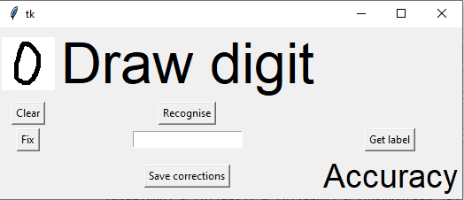
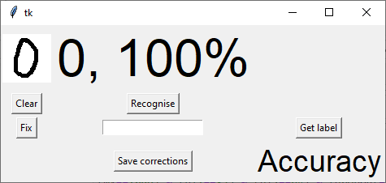
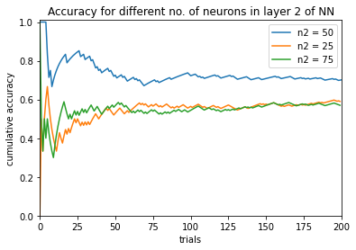
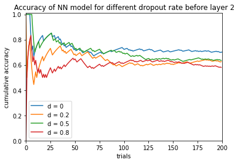
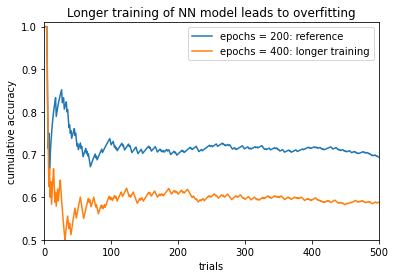
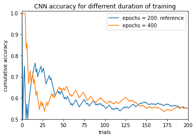
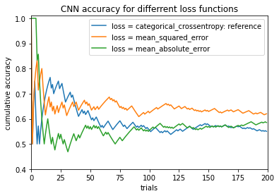
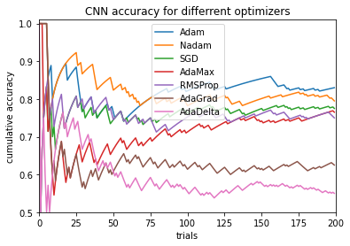
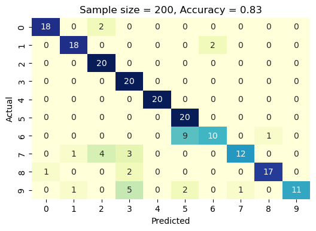
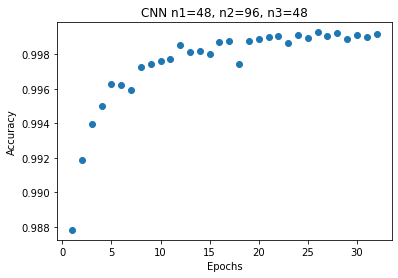

# Digit Recognition using Convolutional Neural Networks
Image recognition (digits 0 - 9 from the MNIST dataset) using Sequential and Convolutional Neural Networks (CNN).

## Data
The <b>training data</b> consists of 60000 images of handwritten digits from the MNIST dataset, together with up to 1600 images drawn manually in a tkinter GUI that was developed here, and 42000 images from the Kaggle machine learning competition ["Digit Recognizer"](https://www.kaggle.com/competitions/digit-recognizer/).
The <b>testing data</b> consists of 10000 MNIST images with known labels and 28000 Kaggle images without labels for competition scoring.
<b>Format</b>: images have black background and white-grey digits. Digits are represented as a 28×28 matrix where each cell contains grayscale pixel value from 0 (black) to 255 (white). There are 10 classes, one for each digit.

## Scoring of hyperparameters
Neural networks were scored in three ways:
+ using 10000 MNIST test images,
+ by hand-writing digits in a tkinter Graphical User Interface (GUI),
+ by comparing labels predicted for 28000 Kaggle images with the true labels (undisclosed) that I obtained by reaching the 100% prediction accuracy in the competition.

## Neural Network models
### Sequential NN model
<b>Hyperparameters</b> of the sequential NN model were varied around the following reference values.
| Layer | Neurons | Activation | dropout |
| ----- | ------- | ---------- | ------- |
| Dense | 50 | ReLU | <b>0</b> |
| Dense | <b>50</b> | ReLU | 0 |
| Dense | 10 | softmax | - |

Varied hyperparameters are in bold. The model was <b>compiled</b> with the Adam <b>optimizer</b> and 'categorical_crossentropy' <b>loss function</b>. Reference value of a training parameter: epochs = 200. Minimal number of trials in recognizing the handwritten images was 200, often used value was 500, and the maximal one was 1150.

### Convolutional Neural Networks (CNN)
A CNN model generally consists of convolutional and pooling layers. It works better for data that are represented as grid structures, - this is the reason why CNN works well for image classification problems. One image is distinguishable from another by its spatial structure. Areas close to each other are highly significant for an image.
  The dropout layer is used to deactivate some of the neurons and while training, it reduces overfitting of the model. It randomly kills each neuron in layer of a training set with probability $p$, typically 0.5 (half of the neurons in a layer are dropped during the training). Therefore, the network cannot rely on activation of any set of hidden units, since they may be turned off at any time during training, and the model is forced to learn more general and more robust patterns from the data. We do not use dropout during validation of the data.
  <b>Convolution layers</b> use a <b>kernel</b> (filter, or matrix), usually 3 x 3 or 5 x 5. Center element of the kernel is placed over the source pixel. The source pixel is then replaced with the sum of elementwise products in the kernel and corresponding nearby source pixels. Convolving the kernel over the image in all possible ways gives 2D <b>activation map</b>. Convolving decreases the spatial size.

<b><i>Max Pooling</i>:</b> Keep only a maximal value from each block, e.g., 2 x 2.
<b>Hyperparameters</b> of the sequential CNN model were varied around the following reference values.

| Layer | Neurons | Activation | kernel_size  / pool_size | dropout |
| ----- | ------- | ---------- | ----- | --- |
| Conv2D | 32 | ReLU | 3, 3 | 0 |
| Conv2D | 64 | ReLU | 3, 3 | 0 |
| MaxPooling2D | - | - | 2, 2 | 0.25 |
| Conv2D* | <b>0</b> | ReLU | 3, 3 | 0 |
| MaxPooling2D* | - | - | 2, 2 | 0.25 |
| Flatten | - | - | - | - |
| Dense | 256 | ReLU | - | 0.5 |
| Dense | 10 | softmax | - | - |

*optional layers

The CNN models were <b>compiled</b> with the Adam optimizer as a benchmark. Reference value of a training parameter: epochs = 200.

## User feedback via GUI
User feedback is enabled via a tkinter <b>GUI</b> created here and allowing user to draw a digit using mouse, see its neural network model-generated classification as one of the digits, allow specifying a correct label in case it is misclassified, save the misclassified image and its label for model re-training, and keep track of prediction accuracy. The GUI is implemented using Tkinter library that comes in the Python standard library. The App class is responsible for building the GUI for our app. It has a canvas where one can draw by capturing the mouse event. Functions are triggered by pushing control buttons: button 'Clear' clears canvas and button 'Recognise' activates the function predict_digit() to recognize the digit. This function takes the image as input and then uses the trained model to predict the digit. The predicted label and its probability percentage are displayed.
#### Instructions for GUI:
1. Start by drawing a digit in the canvas window (60 x 60 pixels).

2. Press “Recognise” and see the predicted class and its probability.

3. If classified correctly, press “Clear” and go to Step 1.
4. Otherwise, if the handwritten digit is misclassified, press "Fix" button to add the image to train set, which will be concatenated with the MNIST data before next training cycle.
5. Type in correct label and press "Get label" button to add the label to train set.

6. Press "Save corrections" button to save manually labelled images and labels, and clean memory.
7. Current accuracy % of recognizing hand-written digits is displayed on the bottom right.

## Results
The recognition of handwritten digits was tested by applying the model to 10,000 test images and in the actual test by handwriting the digits in the GUI window. We iterated over the digits from 0 to 9 until accuracy curve has reduced its fluctuations. During the development of GUI, 78 misclassified digits were encountered, which were not saved. After implementing the user feedback in the GUI, all misclassified images and their correct labels were saved in two CSV files (all [images](images.csv) in one file and all [labels](labels.csv) in a separate file).

### NN models
The following <b>hyperparameters</b> were optimized:
* $n_{2}$ – number of neurons in layer 2 of NN model,
* dropout,
* epochs,
* $m$ - number of manually labeled images added to training data.

Testing a few values of $n_{2}$ using GUI shows that the optimal number of neurons in layer 2 is between 25 and 75, unless there are several maxima in accuracy.

The effect of dropout after first layer is negative: accuracy decreases for the three tested values dropout = {0.2, 0.5, 0.8}.

Longer training of NN (epochs = 400) led to overfitting: accuracy has dropped from 0.694 down to 0.588.

The highest accuracy was achieved by adding manually labeled images and re-training the model with these data added to the MNIST database. The more data added, the higher the accuracy is. However, there is no difference in accuracy between 400 and 600 manual labels added, since all 200 additional labels were generated during testing of lower-accuracy models, and not the model with 400 manual labels. The number of added labeled images is indicated in the legend following the ‘ml’. Same situation with no useful labels added to 800 manual labels among extra 200 labels leads to a slight degradation in accuracy, which drops from 0.966 for 800 manual labels down to 0.934 (after 500 trials).

  It was observed that test accuracy and loss are not reliable metrics of actual performance due to the lack of association with the actual accuracy. As an example, after adding 200 manually labeled images, test accuracy has slightly decreased (from 0.9752 to 0.9741), while the actual performance of digit recognition of the images drawn in the GUI window has strongly increased.

### CNN models
Training CNN model longer (400 epochs) did not lead to a change in accuracy of recognizing images hand-written in the GUI, which stayed at 0.55 (after 200 trials).

  Different loss functions were tested, including user-defined mean absolute error function. Some improvement in accuracy was achieved, as measured after 200 trials. The ranking of the loss functions together with corresponding accuracies is: ‘categorical_crossentropy’ (0.55), ‘mean_absolute_error’ (0.585), and ‘mean_squared_error’ (0.62).

  When testing optimizers, it was found that ‘Adam’ gives much higher accuracy of 0.83 than ‘Adadelta’ with the accuracy of 0.55. Other optimizers have accuracy values between the above two, except for ‘Ftrl’ optimizer, which could not train within 200 epochs and always predicted digit 1, and thus had an accuracy of 0.1.

## Kaggle competition "Digit Recognizer"
Accuracy of the CNN models was also tested using 28000 [Kaggle test images](https://www.kaggle.com/competitions/digit-recognizer/). Specifically, the effect of the duration of training (number of epochs) was studied, as shown below.

The highest accuracy is 0.999286, achieved using 26 training epochs. This means 20 misclassified images out of total 28000. The loss function is categorical crossentropy, and the optimizer is Adam.

## Conclusions
1. It is well worth saving misclassified digit images and their correct labels for re-training of the model. This can be seen from the following table of accuracy of handwritten digit recognition after 500 trials.

| Manual labels | Accuracy |
| --- | --- |
| 0 | 0.694 |
| 200 | 0.836 |
| 400 | 0.924 |
| 600 | 0.924 |
| <b>800 | 0.966</b> |
| 1000 | 0.934 |

<b>Recommendation 1:</b> Start from the saved model with the best accuracy, test your handwritten digit recognition using GUI, provide correct label for each misclassified image and save these images and labels using GUI. Re-train the model with the added manually labelled images. Repeat the above steps of testing and adding manual labels until performance no longer improves.

2. After adding 200 manually labeled images, test accuracy has slightly decreased (from 0.9752 to 0.9741), while the actual performance of digit recognition of the images drawn in the GUI window has strongly increased. Thus, training accuracy is not a reliable metric of actual performance.
3. NN model is prone to overfitting: the accuracy for 400 training epochs is significantly 
lower than for 200 epochs when not using manual labels.

<b>Recommendation 2:</b> Keep the number of epochs below 400 in NN model.

4. Accuracy is sensitive to the number of neurons in the 2nd layer: 50 neurons have a higher accuracy of 0.694 (after 500 trials) compared to 25 neurons with accuracy of 0.59 and 75 neurons with accuracy of 0.57 (after 200 trials). If there is one maximum of accuracy versus the number of neurons, then we have localized the lower and upper boundary for this hyperparameter.
5. Dropout between the first two layers of NN model lowers the accuracy.

<b>Recommendation 3:</b> Avoid using dropout after the first layer in NN model.

<b>Recommendation 4:</b> First focus on hyperparameters of NN model, which is much faster to train than CNN model. However, keep training the CNN models in the background.

<b>Recommendation 5:</b> When adding more manual labels, generate them using the model that is being upgraded, and not some other lower-accuracy model.
 
 ## Future Directions
* Compare the accuracy of recognition of original hand writer whose manual labels were used to re-train the NN model to the accuracy values for another user with the same models.
* Narrow down the optimal ranges of all hyperparameters within current NN and CNN configurations, including number of neurons in each hidden layer and dropout rates after each layer, loss function, optimizer, and activation functions.
* Test different numbers of layers.
* Minimize the number of control buttons in the GUI to simplify and speed up the process of dealing with misclassified digits. For instance, try to implement input of correct label via hitting Enter key, which would allow one to eliminate the button 'Get label'.
* Enable creation of new classes for letter symbols. This would require switching from integer to string variables for the labels.
